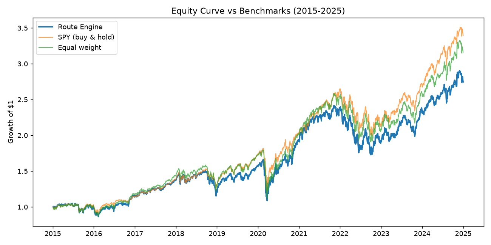

# Route Engine — a regime-aware ETF allocation model

A daily, rules-based strategy that allocates capital across five liquid US ETFs
(SPY, QQQ, IWM, XLF, XLI) using momentum, mean-reversion, volatility, and a
regime signal. Built and backtested in Python over 2015–2025. Originally written
for the Wharton Global High School Investment Competition.

This repo is deliberately honest about results: the strategy is benchmarked
against buy-and-hold, and it does **not** beat the market on a risk-adjusted
basis. The point of the project is the machinery and the methodology, not a
claimed edge. See [Results](#results) for the full comparison.

## How it works

Each day the model scores every ETF and converts those scores into portfolio
weights:

1. **Log returns** are the base unit.
2. **Momentum** — an EMA of recent log returns, also divided by volatility so the
   signal favors trends that are strong *and* stable.
3. **Mean reversion** — a rolling z-score; an ETF far below its recent average
   scores as a bounce-back candidate.
4. **Rolling Sharpe** — a confidence filter that rewards efficient recent returns.
5. **Regime detection (AR(1) φ)** — a rolling autocorrelation of returns. When φ
   is positive, trends tend to persist, so the model leans on momentum; when
   negative, it leans on mean reversion.
6. **Scoring** — signals are standardized *across the basket each day*
   (cross-sectional), blended by regime, and adjusted by the Sharpe filter.
7. **Weights** — positive scores are normalized into weights, capped at 45% per
   ETF, blended toward an equal-weight baseline based on the overall regime, and
   smoothed day-to-day to keep turnover low. Returns are reported net of a
   10 bps transaction cost per unit of turnover.

### A note on look-ahead bias

An earlier version standardized each ETF's signals over the *entire* sample,
which leaks future information into past scores. The current code standardizes
cross-sectionally (per day, across ETFs), so every score uses only information
available at the time. Fixing this moved the Sharpe from 0.57 to 0.54 — small,
which is reassuring, but the point-in-time number is the honest one.

## Results

Backtest over 2015–2025, net of costs:

| Strategy            | Ann. Return | Ann. Vol | Sharpe | Sortino | Max DD  | Final Equity |
|---------------------|------------:|---------:|-------:|--------:|--------:|-------------:|
| **Route Engine**    |       10.1% |    18.9% |  0.535 |   0.647 |  -34.6% |        2.75x |
| SPY (buy & hold)    |       12.2% |    17.7% |  0.693 |   0.820 |  -33.7% |        3.40x |
| Equal weight (5 ETF)|       11.5% |    19.3% |  0.599 |   0.720 |  -37.6% |        3.16x |



Average turnover is ~3.8% per day. A 500-path Monte Carlo bootstrap of the daily
returns gives roughly a 72% chance of a positive year.

**Honest read:** the strategy trails both benchmarks on Sharpe and Sortino. It is
~97% correlated to SPY because the basket is five equity ETFs that move together,
so it offers little diversification and no real downside protection (on the
market's worst 5% of days it loses slightly *more* than SPY). The natural next
step to create a genuine edge would be adding a non-equity, risk-off asset (cash,
short-term Treasuries, or gold) for the model to rotate into during weak regimes.

Figures are written to `results/` when you run the model:
`equity_curve.png`, `drawdown.png`, `allocation_heatmap.png`, `monte_carlo.png`.

## Structure

- `quant_route.py` — main pipeline: load data, build weights, backtest, plot
- `metrics.py` — signal and feature engineering
- `scoring.py` — cross-sectional composite scoring
- `portfolio.py` — turnover, weight smoothing, transaction costs

## Running it

```bash
pip install -r requirements.txt
python quant_route.py
```

The first run downloads prices from Yahoo Finance and caches them to
`data/etf_adj_close.csv`; later runs read the cache and run fully offline.

## Disclaimer

For educational and research purposes only. Not investment advice.
</content>
